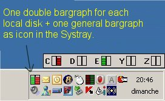



## Disk Activity monitoring

### Description

Monitor all your disks activity. 

----

One double bargraph - Read/Write - for each local disk -- hideable - Autostartable with Windows session -- I've use (and corrected) the excellent source from Ed Wilk (links inside code) to generate the icone image from calculated bitmap. -- Sorry, all comments are written in french, but variable names are english
 
### More Info
 

             |
---                |---
**Submitted On**   |2006-04-17 00:40:24
**By**             |[The\_Jokez](https://github.com/Planet-Source-Code/PSCIndex/blob/master/ByAuthor/the-jokez.md)
**Level**          |Intermediate
**User Rating**    |5.0 (20 globes from 4 users)
**Compatibility**  |VB 6\.0
**Category**       |[Files/ File Controls/ Input/ Output](https://github.com/Planet-Source-Code/PSCIndex/blob/master/ByCategory/files-file-controls-input-output__1-3.md)
**World**          |[Visual Basic](https://github.com/Planet-Source-Code/PSCIndex/blob/master/ByWorld/visual-basic.md)
**Archive File**   |[Disk\_Activ1987614162006\.zip](https://github.com/Planet-Source-Code/the-jokez-disk-activity-monitoring__1-65028/archive/master.zip)

